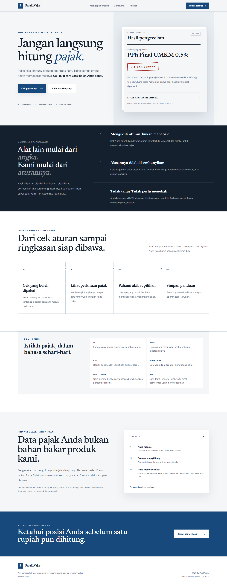
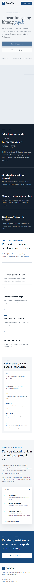
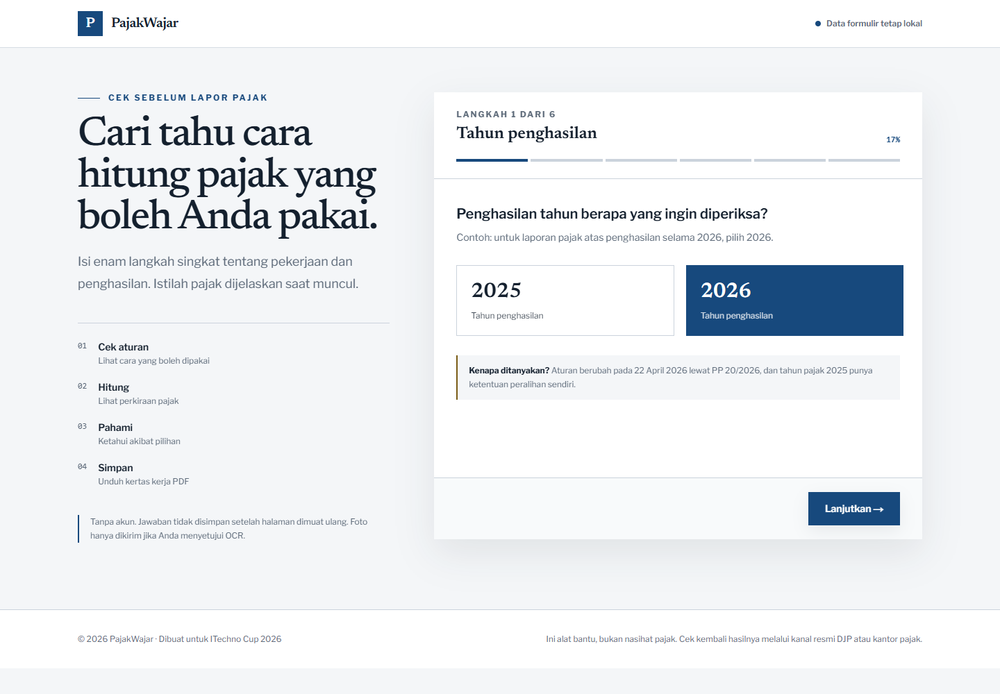
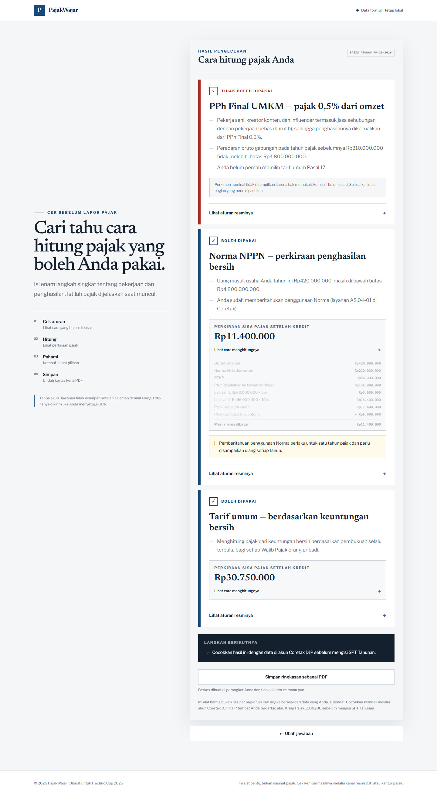
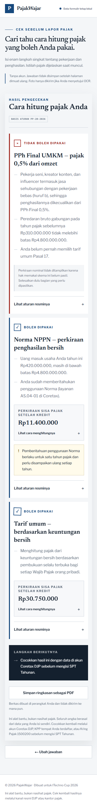
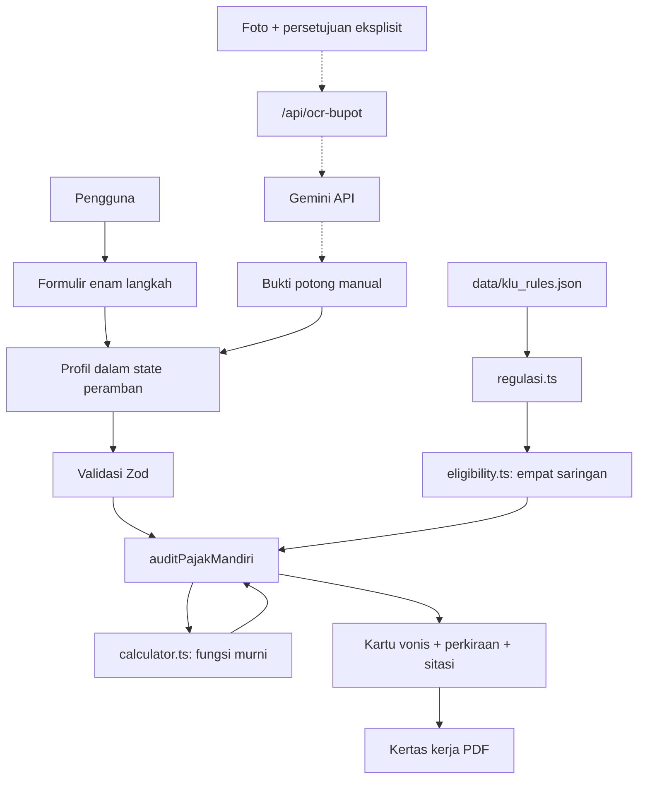

<div align="center">

# PajakWajar
### Cek dulu skemanya, baru hitung pajaknya.

[](https://pajak-wajar.vercel.app/)
[](https://github.com/AkuSukaProject/Pajak-Wajar)
[](LICENSE)
[](#fitur-unggulan)
[](#testing)

**Submission for ITECHNO CUP 2026 - Web Development**

**By AkuSukaProject**

</div>

---

## 📋 Daftar Isi

- [Tentang Proyek](#tentang-proyek)
- [Fitur Unggulan](#fitur-unggulan)
- [Demo & Screenshot](#demo-screenshot)
- [Teknologi](#teknologi)
- [Arsitektur Sistem](#arsitektur-sistem)
- [Instalasi & Setup](#instalasi-setup)
- [Penggunaan](#penggunaan)
- [API Documentation](#api-documentation)
- [Testing](#testing)
- [Tim Developer](#tim-developer)
- [Lisensi](#lisensi)

---

<a id="tim-developer"></a>

## 👥 Tim Developer

| Nama | Peran | GitHub |
|------|-------|--------|
| **Sheva Ramadhan** | Rule Engine & Kalkulator | [@Shevaramadhan](https://github.com/Shevaramadhan) |
| **Mikail Samyth Habibillah** | Frontend & Antarmuka Pengguna | [@samythh](https://github.com/samythh) |
| **Muhammad Habib** | Integrasi, OCR & Dokumentasi | [@muhammadhabib16](https://github.com/muhammadhabib16) |

---

<a id="tentang-proyek"></a>

## 🎯 Tentang Proyek

### Latar Belakang

Pekerja mandiri perlu memahami cara menghitung pajak yang sesuai dengan kondisi pekerjaannya sebelum menyiapkan laporan tahunan. Istilah perpajakan, pilihan skema, dan pertanyaan tentang riwayat pelaporan dapat terasa rumit bagi pengguna yang belum terbiasa.

PajakWajar dikembangkan sebagai platform web pra-lapor untuk membantu pekerja lepas, kreator konten, dan pelaku usaha mikro di Indonesia memahami proses tersebut melalui pertanyaan sederhana.

### Solusi yang Ditawarkan

PajakWajar bekerja dengan urutan **kelayakan → perhitungan → konsekuensi → berkas**. Pengguna mengisi profil, melihat skema mana yang sah dipakai beserta pasal yang mendasarinya, lalu melihat perkiraan pajak hanya untuk skema yang memang berhak, dan menyimpannya sebagai kertas kerja PDF.

Seluruh keputusan kelayakan dan seluruh perhitungan lahir dari aturan yang ditulis eksplisit di `data/klu_rules.json`. Tidak ada model bahasa yang ikut memutuskan hak hukum atau menghitung angka. AI dipakai pada tepat satu titik, yaitu membaca foto bukti potong menjadi angka terstruktur, dengan persetujuan eksplisit pengguna dan mode ketik manual yang selalu tersedia.

> **Status saat ini:** demo publik tersedia di [pajak-wajar.vercel.app](https://pajak-wajar.vercel.app/), dari repo pribadi `samythh/Pajak-Wajar`. Tim tetap **AkuSukaProject**. Formulir, kalkulator, PDF, dan OCR dengan bukti potong contoh sudah diuji. Kasus pajak keluarga, riwayat final 2025, multi-kegiatan, serta peralihan tertentu masih memerlukan pemeriksaan tambahan; sistem menahan nominal yang belum dapat dipastikan. Ini alat bantu, bukan nasihat pajak.

### Tujuan Proyek

- 🎯 **Tujuan utama:** membantu pengguna memeriksa kelayakan skema sebelum menghitung pajak.
- 👤 **Target pengguna:** pekerja lepas, kreator konten, dan pelaku usaha mikro orang pribadi.
- 💡 **Value proposition:** kalkulator pajak yang ada langsung menghitung angka dan mengandaikan pengguna sudah tahu skema mana yang berhak ia pakai. PajakWajar memeriksa haknya lebih dulu, menyertakan pasalnya, dan menolak menampilkan angka untuk skema yang haknya belum pasti.

---

<a id="fitur-unggulan"></a>

## ✨ Fitur Unggulan

### Fitur Utama

| Fitur | Deskripsi | Keunggulan |
|-------|-----------|------------|
| **Uji kelayakan di hulu** | Empat saringan menguji hak pengguna sebelum satu angka pun dihitung: pekerjaan bebas, ambang peredaran bruto gabungan, pintu satu arah tarif umum, serta pemberitahuan dan ambang Norma. | Menjawab pertanyaan yang dilewati kalkulator lain: skema mana yang sah untuk saya? |
| **Kartu hasil tiga status** | `BOLEH`, `TIDAK_BOLEH`, dan `PERLU_DIPASTIKAN` untuk tiga skema, lengkap dengan alasan per syarat. | Skema yang tidak boleh tetap ditampilkan dalam keadaan diredam, bukan disembunyikan. |
| **Setiap vonis bersitasi** | Tiap kartu memuat nama regulasi, nomor pasal dan ayat, fungsi kutipan, serta tautan ke JDIH Kemenkeu atau pajak.go.id. | Rujukan yang belum tuntas diperiksa ditandai “masih diperiksa”, bukan disamarkan. |
| **Perhitungan tiga skema** | PPh Final 0,5%, Norma NPPN, dan tarif umum Pasal 17 dengan tarif progresif **berlapis** dan kredit bukti potong. | Panel “Lihat cara menghitungnya” memperlihatkan tiap lapisan tarif, bukan hanya hasil akhir. |
| **Perhitungan menolak menebak** | Nominal tidak ditampilkan bila haknya belum pasti, bila pengguna punya lebih dari satu kegiatan (Norma), atau bila biaya usaha belum diisi (tarif umum). | Biaya usaha yang dikosongkan tidak pernah dianggap Rp0 karena akan melambungkan pajak. |
| **Pilihan “Tidak yakin”** | Setara dengan pilihan lain pada setiap pertanyaan riwayat. | Jawaban tidak pasti menghasilkan `PERLU_DIPASTIKAN` beserta langkah untuk memastikannya, bukan tebakan. |
| **Bukti potong manual dan OCR** | Ketik manual sebagai jalur utama; pembacaan foto opsional dan hanya berjalan setelah persetujuan dicentang. | Hasil OCR masuk ke kolom yang sama dengan isian manual sehingga wajib ditinjau pengguna. |
| **Kertas kerja PDF** | Ringkasan vonis, sitasi, dan rincian perhitungan dalam satu berkas. | Dirakit di peramban; angka finansial tidak dikirim ke server. |
| **Tanpa akun** | Langsung dipakai; jawaban hidup di state peramban. | Tidak ada registrasi, tidak ada basis data. |

### Fitur Tambahan

- **Tampilan responsif** — tata letak untuk desktop dan perangkat seluler.
- **Kamus mini** — penjelasan istilah SPT, omzet, PTKP, skema pajak, NPPN, dan DJP.
- **Navigasi formulir** — tombol kembali, validasi pemilihan pekerjaan, dan pilihan mengubah jawaban setelah melihat hasil.
- **Animasi antarmuka** — transisi langkah dan kemunculan kartu hasil.

### Rencana Pengembangan

- [x] Menyelesaikan verifikasi regulasi terhadap teks asli PP 20/2026 dan menghubungkan daftar KLU ke formulir.
- [x] Mengimplementasikan mesin kelayakan dan kalkulator deterministik.
- [x] Menghubungkan skema Zod ke alur input melalui orkestrator `auditPajakMandiri`.
- [x] Menampilkan perbandingan perhitungan serta konsekuensi pilihan skema.
- [x] Menambahkan input bukti potong manual, kemudian OCR dengan persetujuan pengguna.
- [x] Menghasilkan PDF kertas kerja pra-lapor.
- [x] Mengimplementasikan pengujian aturan dan perhitungan (lihat jumlah terbaru pada bagian Testing).
- [x] Mencocokkan persentase Norma ke Lampiran I PER-17/PJ/2015, baris per baris (17 dari 20 KLU ternyata salah dan sudah dikoreksi).
- [x] Menguji route OCR: 18 tes dengan layanan disimulasikan, plus satu tes ke Gemini sungguhan yang sudah berhasil dengan gambar contoh.
- [ ] Mencocokkan kode KLU ke KBLI 2020.
- [x] Menjalankan `npm run test:ocr` dengan `GEMINI_API_KEY` sungguhan.
- [x] Deployment publik ke Vercel melalui repo pribadi.

---

<a id="demo-screenshot"></a>

## 📸 Demo & Screenshot

### Live Demo

Buka **[PajakWajar](https://pajak-wajar.vercel.app/)** atau langsung **[cek kelayakan](https://pajak-wajar.vercel.app/cek-kelayakan)**. Deployment terhubung ke `main` pada repo pribadi `samythh/Pajak-Wajar`; repo organisasi tetap menjadi repositori tim. Lihat [panduan deployment](./docs/DEPLOYMENT.md) dan [skenario demo](./docs/DEMO.md).

### Screenshot Aplikasi

Screenshot berikut diambil dari build produksi lokal pada 5 September 2026 memakai data fiktif. Angka pada gambar dihasilkan mesin aturan yang sama dengan yang dipakai pengguna, bukan data mock.

<div align="center">
  
  <p><em>Homepage — pengenalan konsep pemeriksaan kelayakan sebelum perhitungan.</em></p>

  
  <p><em>Tampilan seluler — tata letak halaman utama pada layar kecil.</em></p>

  
  <p><em>Formulir — pemilihan pekerjaan, cara menjalankannya, kelompok wilayah, dan jumlah kegiatan.</em></p>

  
  <p><em>Hasil — kreator konten: PPh Final tertutup oleh Pasal 56 ayat (4) huruf b, dua skema lain terhitung.</em></p>

  
  <p><em>Hasil pada layar kecil — kartu vonis tetap terbaca penuh.</em></p>
</div>

### Video Demo

[Unduh rekaman demo aplikasi](./docs/demo/pajakwajar-demo.webm). Rekaman tanpa narasi ini memperagakan enam langkah, bukti potong manual, hasil perhitungan, unduhan PDF, dan perubahan jawaban. [Skenario narasi](./docs/DEMO.md) tersedia untuk presentasi tim.

Contoh keluaran kertas kerja tersedia sebagai berkas: [contoh-kertas-kerja.pdf](./docs/demo/contoh-kertas-kerja.pdf).

[Skenario presentasi dan panduan menjalankan demo](./docs/DEMO.md) tersedia untuk persiapan video submission akhir.

---

<a id="teknologi"></a>

## 🛠️ Teknologi

### Tech Stack

#### Frontend

```text
Framework    : Next.js 15.5.23 (App Router), React 19
Language     : TypeScript
Styling      : Tailwind CSS 3, CSS khusus proyek
State Mgmt   : React useState
Validation   : Zod (profil, bukti potong, dan jawaban OCR)
Form Library : tidak dipakai; validasi berjalan di batas orkestrator `auditPajakMandiri`
PDF          : @react-pdf/renderer (kertas kerja dirakit di peramban, dimuat saat tombol ditekan)
```

#### Backend

```text
Runtime      : Node.js untuk menjalankan Next.js
API          : POST /api/ocr-bupot (satu-satunya endpoint; perantara kunci API)
Database     : Tidak digunakan
ORM          : Tidak digunakan
Auth         : Tidak digunakan; akses tanpa akun
OCR          : Gemini API, structured JSON, temperature 0; opsional dan butuh persetujuan
```

#### DevOps & Tools

```text
Package Mgmt : npm dengan package-lock.json
Deployment   : Vercel (region sin1), https://pajak-wajar.vercel.app/
CI/CD        : Belum ada workflow di repositori
Testing      : Vitest; 136 tes rutin pada 8 berkas. Ajv 2020 untuk integritas data aturan
Type Check   : TypeScript (tsc --noEmit), tanpa `any`
Monitoring   : Belum dikonfigurasi
```

### Alasan Pemilihan Teknologi

| Teknologi | Peruntukan dalam Proyek |
|-----------|------------------------|
| **Next.js & React** | Menyediakan routing halaman dan komponen interaktif untuk alur pemeriksaan. |
| **TypeScript** | Mendefinisikan kontrak profil, skema pajak, dan hasil yang dipakai bersama antar-modul. |
| **Tailwind CSS** | Menyusun tampilan responsif dengan warna, tipografi, dan komponen khusus PajakWajar. |
| **Zod** | Memvalidasi profil, bukti potong, dan jawaban layanan OCR sebelum satu pun aturan dievaluasi. |
| **Vitest** | Menguji kelayakan dan perhitungan terpisah dari antarmuka; 80 kasus. |
| **Ajv (Draft 2020-12)** | Menjaga bentuk `data/klu_rules.json` dengan `additionalProperties: false` agar regulasi tidak berubah diam-diam. |
| **@react-pdf/renderer** | Merakit kertas kerja di peramban agar angka finansial tidak perlu dikirim ke server. |
| **Gemini API** | Hanya membaca foto bukti potong menjadi angka terstruktur; tidak menyentuh keputusan hukum atau perhitungan. |

### Dependencies Utama

Cuplikan versi yang dideklarasikan di [package.json](./package.json):

```json
{
  "dependencies": {
    "@react-pdf/renderer": "^4.1.5",
    "next": "15.5.23",
    "react": "^19.0.0",
    "react-dom": "^19.0.0",
    "zod": "^3.24.1"
  }
}
```

---

<a id="arsitektur-sistem"></a>

## 🏗️ Arsitektur Sistem

### System Architecture

Garis penuh berjalan di peramban. Hanya kotak bergaris putus-putus yang meninggalkan perangkat pengguna.



Profil hanya berada dalam state React dan tidak dipersistenkan; memuat ulang halaman menghapus jawaban. Satu-satunya data yang keluar dari perangkat adalah foto bukti potong, dan hanya setelah pengguna mencentang persetujuan. Rinciannya di [docs/ARSITEKTUR.md](./docs/ARSITEKTUR.md).

### Database Schema

Proyek tidak menggunakan basis data. Struktur utamanya adalah:

| Berkas / Tipe | Isi |
|---------------|-----|
| `ProfilWajibPajak` | Tahun pajak, KLU, wilayah, PTKP, bentuk kegiatan, status pasangan, dua himpunan omzet, dan jawaban kepatuhan. |
| `KreditPajakItem` | Bukti potong, terpisah dari profil agar OCR tidak mencampuri data profil. |
| `HasilSkema` | Union terdiskriminasi: status kelayakan, syarat, sitasi, status kalkulasi, dan rincian bertipe per skema. |
| `data/klu_rules.json` | Seluruh parameter, aturan kelayakan, sitasi, dan daftar KLU. Satu-satunya sumber regulasi. |
| `data/klu_rules.schema.json` | Kontrak bentuk berkas di atas, JSON Schema Draft 2020-12, diuji dengan Ajv. |

Kontrak TypeScript ada di [src/types/pajak.ts](./src/types/pajak.ts). Dua himpunan omzet tidak boleh dicampur: `omzetPribadiTahunPajak` untuk perhitungan, dan omzet tahun sebelumnya (pribadi + pasangan + perseroan perorangan) hanya untuk uji ambang Rp4,8 miliar.

### Folder Structure

```text
Pajak-Wajar/
├── data/
│   ├── klu_rules.json            # Parameter, aturan kelayakan, sitasi, daftar KLU
│   └── klu_rules.schema.json     # Kontrak bentuk berkas di atas (Draft 2020-12)
├── docs/
│   ├── ARSITEKTUR.md             # Batas modul, dua himpunan omzet, privasi
│   ├── REGULASI.md               # Register pasal + koreksi dokumen internal
│   ├── DEPLOYMENT.md             # Langkah ke Vercel dan variabel lingkungan
│   ├── TESTING.md                # Laporan pemeriksaan
│   ├── DEMO.md                   # Skenario presentasi dan pertanyaan juri
│   ├── sumber/                   # Salinan teks regulasi untuk jejak audit
│   ├── demo/                     # Rekaman demo dan contoh kertas kerja
│   └── screenshots/
├── src/
│   ├── app/
│   │   ├── page.tsx              # Landing page
│   │   ├── cek-kelayakan/        # Halaman formulir
│   │   └── api/ocr-bupot/        # Perantara OCR, kunci API tidak ke peramban
│   ├── components/
│   │   ├── eligibility/          # Formulir, kartu vonis, input bukti potong
│   │   └── berkas/               # Kertas kerja PDF
│   ├── lib/
│   │   ├── regulasi.ts           # Pemuat bertipe untuk data aturan
│   │   ├── eligibility.ts        # Empat saringan kelayakan
│   │   ├── calculator.ts         # Matematika murni
│   │   ├── index.ts              # Orkestrator auditPajakMandiri
│   │   ├── schemas.ts            # Skema Zod
│   │   ├── ocr.ts                # Klien OCR dengan gerbang persetujuan
│   │   └── format.ts             # Pembantu tampilan
│   ├── mock/                     # Profil contoh untuk demo dan tangkapan layar
│   └── types/                    # Kontrak tipe domain
├── tests/                        # 116 tes: schema, calculator, eligibility, audit, ocr, format
│   └── fixtures/                 # Lembar bukti potong contoh untuk uji OCR
├── vitest.config.ts
├── vercel.json
├── eslint.config.mjs
├── LICENSE
├── .env.example
├── package.json
└── README.md
```

Dokumentasi pendukung: [Arsitektur](./docs/ARSITEKTUR.md), [Desain UI](./docs/DESAIN_UI.md), [Regulasi](./docs/REGULASI.md), [Deployment](./docs/DEPLOYMENT.md), [Pemeriksaan](./docs/TESTING.md), [Riset regulasi](./docs/00_CATATAN.md), dan [Rencana Implementasi](./docs/implementation_plan.md).

> Catatan: `docs/00_CATATAN.md` Bagian I angka 3 menyitasi “PP 20/2026 Pasal 59 ayat (3)”. Pasal itu **dihapus** oleh PP 20/2026. Rujukan yang benar adalah Pasal 57 ayat (2) huruf a jo. ayat (3) dan ayat (4). Koreksinya tercatat di [docs/REGULASI.md](./docs/REGULASI.md) dan dijaga oleh uji otomatis.

---

<a id="instalasi-setup"></a>

## ⚙️ Instalasi & Setup

### Prerequisites

- **Node.js 22 atau 24** dan **npm**.
- **Git** untuk mengunduh repositori.
- Peramban untuk membuka aplikasi lokal.

### Langkah Instalasi

#### 1. Clone Repository

```bash
git clone https://github.com/AkuSukaProject/Pajak-Wajar.git
cd Pajak-Wajar
```

#### 2. Install Dependencies

```bash
npm ci
```

Perintah ini memasang dependensi sesuai `package-lock.json`.

#### 3. Setup Environment Variables

Aplikasi berjalan penuh tanpa file environment; hanya pembacaan foto bukti potong yang membutuhkannya. Untuk mengaktifkannya, salin `.env.example` menjadi `.env.local`.

PowerShell:

```powershell
Copy-Item .env.example .env.local
```

macOS / Linux:

```bash
cp .env.example .env.local
```

Isi contoh:

```env
# Hanya diperlukan bila pembacaan foto bukti potong (OCR) diaktifkan.
GEMINI_API_KEY=

# Opsional. Bawaan: gemini-3.6-flash
GEMINI_MODEL=
```

Tanpa kunci ini, `/api/ocr-bupot` menjawab 503 dan antarmuka mengarahkan pengguna mengetik angkanya manual. Kunci rahasia tidak boleh memakai awalan `NEXT_PUBLIC_` atau dimasukkan ke repositori.

#### 4. Setup Database

Tidak diperlukan. Proyek tidak menggunakan database, migrasi, atau seed.

#### 5. Run Development Server

```bash
npm run dev
```

Buka [http://localhost:3000](http://localhost:3000).

---

<a id="penggunaan"></a>

## 🚀 Penggunaan

### Menjalankan Aplikasi

```bash
# Development mode
npm run dev

# Production build dan server
npm run build
npm run start

# Menjalankan daftar pengujian
npm test

# Memeriksa tipe TypeScript
npx tsc --noEmit
```

Jalankan `npm run lint` untuk memeriksa aturan Next.js, React, dan TypeScript melalui ESLint. Perintah `npm run typecheck` tersedia untuk pemeriksaan tipe.

### User Guide

#### Untuk Pengguna Umum

1. Buka halaman utama dan pilih **Cek pajak saya**; tidak perlu registrasi atau login.
2. **Tahun penghasilan** — pilih **2025** atau **2026**.
3. **Pekerjaan utama** — pilih kegiatan, lalu jawab bagaimana Anda menjalankannya (sendiri dengan keahlian, sebagai usaha berpegawai, atau berdagang), kelompok wilayah, dan apakah kegiatannya lebih dari satu.
4. **Keluarga dan uang masuk** — isi PTKP, omzet tahun berjalan, biaya usaha setahun, dan status pegawai tetap bila relevan.
5. **Tahun sebelumnya** — isi omzet tahun sebelumnya, cara Anda dan pasangan melapor pajak, serta omzet PT Perorangan. Angka-angka ini hanya dipakai menguji batas Rp4,8 miliar, tidak untuk menghitung pajak.
6. **Riwayat pilihan pajak** — jawab soal pemberitahuan Norma dan pemilihan tarif umum. **Tidak yakin** adalah jawaban yang sah dan setara.
7. **Bukti potong** — ketik pemotongan yang sudah terjadi, atau lewati bila tidak ada. Pembacaan foto bersifat opsional dan hanya berjalan setelah persetujuan dicentang.
8. Klik **Lihat hasil pengecekan**. Buka **Lihat cara menghitungnya** untuk melihat tiap lapisan tarif, dan **Lihat aturan resminya** untuk membuka pasal yang mendasarinya.
9. Tekan **Simpan ringkasan sebagai PDF**, atau **Ubah jawaban** untuk kembali ke formulir.

Bila sebuah skema berstatus **PERLU DICEK DULU**, nominalnya sengaja tidak ditampilkan. Selesaikan dulu bagian yang perlu dipastikan, lalu ulangi.

#### Untuk Admin

Tidak ada akun atau panel admin. Pengembangan data aturan dilakukan melalui berkas dalam `data/` dan dokumentasi regulasi dalam `docs/`.

---

<a id="api-documentation"></a>

## 📚 API Documentation

### Base URL & Endpoints

| Metode | Path | Fungsi |
|--------|------|--------|
| `GET` | `/` | Halaman utama. |
| `GET` | `/cek-kelayakan` | Formulir dan hasil pemeriksaan. |
| `POST` | `/api/ocr-bupot` | Membaca foto bukti potong menjadi angka terstruktur. |

`POST /api/ocr-bupot` menerima `{ persetujuan: true, mimeType, dataBase64 }` dan mengembalikan `{ nomorBuktiPotong, pemotong, tanggal, penghasilanBruto, pphDipotong }`. Route menolak permintaan tanpa persetujuan (403), jenis berkas di luar JPG/PNG/WebP (415), berkas terlalu besar (413), dan menjawab 503 bila `GEMINI_API_KEY` tidak diisi. Setiap jawaban divalidasi ulang dengan Zod sebelum dikirim ke peramban. Foto tidak ditulis ke penyimpanan mana pun.

### Kontrak Modul Internal

| Modul | Kontrak | Peran |
|-------|---------|-------|
| `lib/index.ts` | `auditPajakMandiri(input): HasilAuditPajak` | Orkestrator: validasi, kelayakan, lalu perhitungan untuk skema yang berhak. |
| `lib/eligibility.ts` | `periksaKelayakan(profil)`, `agregasiPrioritas(syarat)`, `hitungOmzetKonsolidasi(profil)` | Empat saringan kelayakan. Tidak menghitung nominal apa pun. |
| `lib/calculator.ts` | `hitungPphFinal`, `hitungNppn`, `hitungTarifUmum`, `hitungTarifProgresifBerlapis` | Fungsi murni; menerima parameter regulasi sebagai argumen. Tidak menilai hukum. |
| `lib/regulasi.ts` | `basisAturan`, `cariKlu`, `daftarKlu`, `persenNorma` | Pemuat bertipe untuk `data/klu_rules.json`. |
| `lib/schemas.ts` | `profilWajibPajakSchema`, `inputAuditPajakSchema`, `hasilBupotOcrSchema` | Validasi masukan dan jawaban OCR. |
| `lib/ocr.ts` | `bacaBupotDenganPersetujuan(file, setuju, signal)` | Melempar `GalatPersetujuan` bila persetujuan belum diberikan. |

### Contoh Penggunaan Modul

Pemeriksaan penuh berjalan di peramban; ini bukan request ke server:

```typescript
import { auditPajakMandiri } from '@/lib';

const hasil = auditPajakMandiri({
  profil: {
    tahunPajak: 2026,
    kluKode: '90002',                       // kreator konten
    wilayah: 'kelompok1',
    statusPtkp: 'TK/0',
    bentukKegiatan: 'PEKERJAAN_BEBAS',
    statusPerpajakanPasangan: 'TIDAK_ADA_PASANGAN',
    punyaLebihDariSatuKegiatan: false,
    omzetPribadiTahunPajak: 420_000_000,    // dasar PERHITUNGAN
    biayaOperasionalRiil: 95_000_000,
    omzetPribadiThnSebelumnya: 310_000_000, // dasar UJI AMBANG
    omzetPasanganThnSebelumnya: 0,
    omzetSeluruhPerseroanPeroranganThnSebelumnya: 0,
    sudahMemberitahukanNppn: true,
    pernahPilihTarifUmum: false,
    jugaPegawaiTetap: false,
    pernahMelewatiAmbang: false
  },
  kreditPajak: []
});

for (const skema of hasil.skema) {
  console.log(skema.id, skema.statusKelayakan, skema.statusKalkulasi);
}
// PPH_FINAL_05 TIDAK_BOLEH TIDAK_RELEVAN   ← Pasal 56 ayat (4) huruf b
// NPPN         BOLEH       TERSEDIA
// TARIF_UMUM   BOLEH       TERSEDIA
```

`statusKalkulasi` adalah union terdiskriminasi: hanya `TERSEDIA` yang membawa `pajakTerutang` dan `rincianKalkulasi`, sehingga nominal mustahil muncul pada skema yang haknya belum pasti.

---

<a id="testing"></a>

## 🧪 Testing

### Running Tests

```bash
# Menjalankan Vitest satu kali
npm test

# Mode watch selama pengembangan
npm run test:watch

# Pemeriksaan tipe
npx tsc --noEmit

# Memeriksa build produksi
npm run build
```

### Test Coverage

**136 tes rutin** pada delapan berkas, ditambah satu tes integrasi OCR opsional:

| Berkas | Tes | Fokus |
|--------|-----|-------|
| [tests/schema.test.ts](./tests/schema.test.ts) | 11 | Integritas `data/klu_rules.json` lewat Ajv Draft 2020-12; domain sumber primer; larangan menyitasi Pasal 59 yang sudah dihapus; persentase Norma ke-22 KLU dikunci pada fixture Lampiran I. |
| [tests/calculator.test.ts](./tests/calculator.test.ts) | 14 | Tarif progresif berlapis, termasuk bukti bahwa PKP Rp337 juta ≠ PKP × 25% dan kecocokan dengan contoh resmi UU HPP (PKP Rp6 miliar → Rp1.794.000.000). |
| [tests/eligibility.test.ts](./tests/eligibility.test.ts) | 32 | Agregasi prioritas dan empat saringan kelayakan. |
| [tests/audit-pajak.test.ts](./tests/audit-pajak.test.ts) | 13 | Konsistensi status kalkulasi dan batasan perhitungan. |
| [tests/schemas.test.ts](./tests/schemas.test.ts) | 15 | Kontrak masukan formulir dan bukti potong. |
| [tests/audit-regression.test.ts](./tests/audit-regression.test.ts) | 15 | Pembulatan PKP, gaji, kelebihan kredit, duplikasi bukti potong, batas pajak keluarga dan riwayat 2025/2026. |
| [tests/format.test.ts](./tests/format.test.ts) | 13 | Pemisah ribuan pada isian nominal, termasuk jaminan titik tidak bocor ke perhitungan. |
| [tests/ocr.test.ts](./tests/ocr.test.ts) | 23 (+1 opsional) | Gerbang persetujuan, batas berkas, dan seluruh kode galat route OCR. Tes nyata dijalankan khusus dengan `npm run test:ocr` dan `GEMINI_API_KEY`; `npm test` tidak mengirim gambar. |

Pemeriksaan ulang 6 September 2026 mencakup lint, tipe, build produksi, regresi pembulatan PKP dan gaji, input ganda, browser mobile/desktop, serta PDF. Rinciannya di [laporan pemeriksaan](./docs/TESTING.md).

Persentase coverage belum diukur. Script E2E dan coverage belum dikonfigurasi sebagai perintah npm.

`npm audit` melaporkan **0 kerentanan** setelah pembaruan Vitest dan dependensi transitif PostCSS serta sharp. Versi terkunci di `package-lock.json`; gunakan `npm ci` untuk instalasi yang sama.

### Pemeriksaan Manual

- Pastikan halaman utama dan formulir dapat dibuka pada desktop dan seluler.
- Pastikan langkah pekerjaan tidak dapat dilewati tanpa memilih satu opsi.
- Periksa navigasi maju, kembali, dan **Ubah jawaban**.
- Pilih kreator konten: PPh Final harus **TIDAK BOLEH DIPAKAI** dan nominalnya tidak muncul.
- Pilih toko online dengan omzet Rp900 juta: PPh Final harus Rp2.000.000.
- Isi pemberitahuan Norma dengan **Tidak yakin**: Norma harus berubah menjadi **PERLU DICEK DULU** dan nominalnya hilang.
- Kosongkan biaya usaha: tarif umum harus menyatakan biaya perlu diisi, bukan menghitung dengan Rp0.
- Buka **Lihat aturan resminya** dan pastikan tautan JDIH terbuka.
- Tekan **Simpan ringkasan sebagai PDF** dan pastikan berkas terunduh.

---

<a id="lisensi"></a>

## 📄 Lisensi

Proyek ini dilisensikan di bawah [MIT License](./LICENSE). Hak cipta © 2026 AkuSukaProject.

PajakWajar adalah alat bantu pra-lapor, bukan nasihat pajak. Verifikasi hasil dan ketentuan yang berlaku melalui Direktorat Jenderal Pajak sebelum digunakan untuk pelaporan.

---

<div align="center">

**Made with ❤️ by AkuSukaProject for ITECHNO CUP 2026**

</div>
